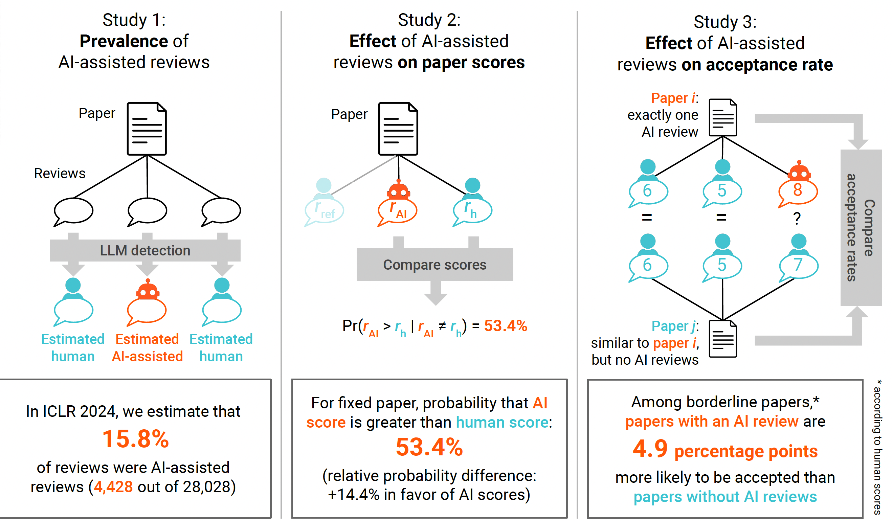

[](https://www.python.org/downloads/release/python-312/)
[](LICENSE)
[](https://arxiv.org/abs/2405.02150)

# The AI Review Lottery: Widespread AI-Assisted Peer Reviews Boost Paper Scores and Acceptance Rates

This repository contains the implementation for the models' data labeling and experiments in [The AI Review Lottery: Widespread AI-Assisted Peer Reviews Boost Paper Scores and Acceptance Rates](https://arxiv.org/abs/2405.02150).

```
@misc{latona2024ai,
      title={The AI Review Lottery: Widespread AI-Assisted Peer Reviews Boost Paper Scores and Acceptance Rates}, 
      author={Giuseppe Russo Latona and Manoel Horta Ribeiro and Tim R. Davidson and Veniamin Veselovsky and Robert West},
      year={2024},
      eprint={2405.02150},
      archivePrefix={arXiv},
      primaryClass={cs.CY}
}
```
**Please consider citing our work, if you found the provided resources useful.**<br>

---
## 1. The Idea and the Repository in a Nutshell


Journals and conferences worry that peer reviews assisted by artificial intelligence (AI), particularly large language models (LLMs), may negatively influence the validity and fairness of the peer-review system, a cornerstone of modern science. In this work, we address this concern with a quasi-experimental study of the prevalence and impact of AI-assisted peer reviews in the context of the 2024 International Conference on Learning Representations (ICLR), a large and prestigious machine-learning conference. In this study, we conducted three analyses:

1. Prevalence of AI-assisted reviews: We quantify the number of reviews labeled as AI-assisted (according to GPTZero LLM detector).
2. Effect of AI-assisted reviews on scores: We quantify the difference between AI-assisted and human review scores on submissions submitted to ICLR2024.
3. Effect of AI-assisted reviews on paper acceptance: We study whether receiving an AI-assisted review boosts the likelihood of acceptance.

These three analysis and the results we obtained are illustrated in 

<div align="center">

</div>


## 2. Data Collection and Dataset Description
Our data collection process consists of two steps:
*  We download papers, reviews, and acceptance decisions from 2018-2024 from the [Openreview API](https://docs.openreview.net/getting-started/using-the-api). 
* We label all reviews as either AI-assisted reviews or human written reviews using [GPTZero](https://gptzero.me/).

By following these steps we obtain the following statistics relative to the datasets we obtained:


| Year | Reviews | Submissions | Acceptance | LLM reviews |
|------|---------|-------------|------------|-------------|
| 2018 | 2921    | 1007        | 36.0%      | 57          |
| 2019 | 4734    | 1569        | 31.5%      | 95          |
| 2020 | 7783    | 2593        | 26.5%      | 123         |
| 2021 | 11488   | 3009        | 29.1%      | 216         |
| 2022 | 13161   | 3422        | 32.0%      | 164         |
| 2023 | 18575   | 4955        | 24.3%      | 176         |
| 2024 | 28028   | 7404        | 30.5%      | 4887        |
| Total| 86690   | 23959       | ---        | ---         |


We structure this dataset in the following folder:

```
analyses/
  -data/
    - submissions_iclr_2018_2024.csv
    - reviews_iclr_2018_2024_annotated.csv
    - decisions_2024.csv
README.md
```

We summarize the structure of each dataset:

**data/submissions_iclr_2018_2024.csv**: This dataset contains all the information about papers submitted to ICLR from 2018 until 2024. 


**| id | creation_date | year | title | abstract | pdf | keywords | authors | authorids |**
- id: submission unique identifier
- creation_date: date of the submission
- year: Year of publication.
- title: Title of the paper.
- abstract: Summary of the paper's content.
- pdf: Path to the PDF file of the paper.
- keywords: Keywords related to the paper's content.
- authors: Names of the authors.
- authorids: Email addresses or other identifiers of the authors.


**data/reviews_iclr_2018_2024_annotated.csv**: This dataset contains all the information about reviews submitted as an evaluation of reviews at ICLR from 2018 until 2024. 

**| id | review_id| year | review | rating | confidence | ai | human | mixed | isAI |**


- id: submission unique identifier
- review_id : review unique identifier
- year: Year of publication.
- review: content of the paper
- rating: score given by the reviewer to the submission
- confidence: confidence of the reviewer in the score provided
- ai: likelihood of the review to be AI-assisted according to GPTZero.
- mixed: likelihood of the review to be mixed (parts human and AI-assisted written) according to GPTZero.
- isAI: if 1 == AI-assisted else human. 


